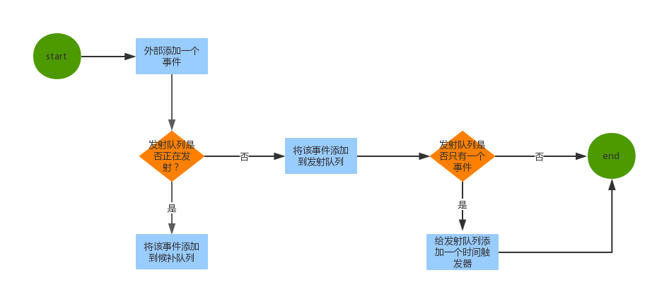
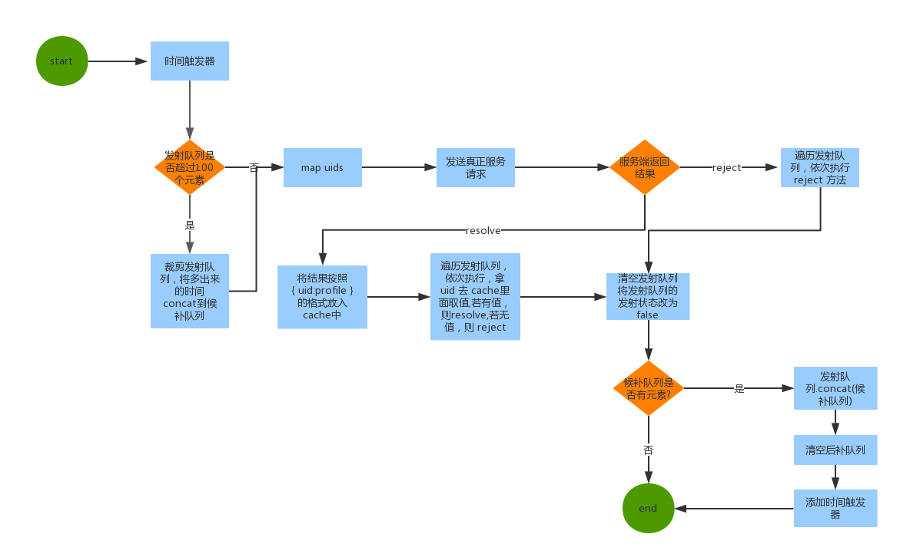

# merge_events
合并给定时间间隔内的事件

## 环境
- ts 2.1.4
- node v4.5.0

## 效果
- npm run dev
- cd demo
- node lib.js (node event_merge_demo.js 可以看到核心 EventMerge对象的使用)

## 流程图

### 外部调用时的逻辑

### 时间触发器工作的逻辑

## todo
- 完善测试用例
